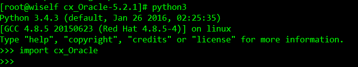

## cx_Oracle
#### Preparatory
* cx_Oracle  
下载地址：[https://pypi.python.org/pypi/cx_Oracle](https://pypi.python.org/pypi/cx_Oracle)
* Oracle_client
使用cx_Oracle必须要安装Oracle_client端，或者你已经安装了Oracle数据库。  
下载地址：[http://www.oracle.com/technetwork/topics/linuxx86-64soft-092277.html](http://www.oracle.com/technetwork/topics/linuxx86-64soft-092277.html)
以连接Oracle11为例需要下载以下rpm包：  
oracle-instantclient11.2-basic-11.2.0.4.0-1.x86_64.rpm  
oracle-instantclient11.2-jdbc-11.2.0.4.0-1.x86_64.rpm  
oracle-instantclient11.2-sqlplus-11.2.0.4.0-1.x86_64.rpm  
oracle-instantclient11.2-devel-11.2.0.4.0-1.x86_64.rpm  
oracle-instantclient11.2-odbc-11.2.0.4.0-1.x86_64.rpm  
oracle-instantclient11.2-tools-11.2.0.4.0-1.x86_64.rpm  

#### Install
* Oracle_client端安装：  
```
$ rpm -ivh oracle-instantclient11.2-basic-11.2.0.4.0-1.x86_64.rpm  oracle-instantclient11.2-jdbc-11.2.0.4.0-1.x86_64.rpm  oracle-instantclient11.2-sqlplus-11.2.0.4.0-1.x86_64.rpm oracle-instantclient11.2-devel-11.2.0.4.0-1.x86_64.rpm  oracle-instantclient11.2-odbc-11.2.0.4.0-1.x86_64.rpm  oracle-instantclient11.2-tools-11.2.0.4.0-1.x86_64.rpm
$ echo /usr/lib/oracle/11.2/client64/lib/ >> /etc/ld.so.conf
$ ldconfig
```
如果不进行ldconfig配置，在运行cx_Oracle时会报以下错误：libclntsh.so.11.1: cannot open shared object file: No such file or directory

* 设置相应用户的环境变量
在这里需要说明下，你使用哪个帐户装cx_Oracle就需要配置哪个帐户的环境变量，以下使用全局变量，即/etc/profile。如果不配置环境变量、或环境变量配置不正确，在安装cx_Oracle时，会报各种错误，比如说：oci.h: No such file or directory  
```
$ vim /etc/profile  
export TNS_ADMIN=/usr/lib/oracle 
export ORACLE_HOME=/usr/lib/oracle/11.2/client64  
export LD_LIBRARY_PATH=${LD_LIBRARY_PATH}:${ORACLE_HOME}/lib  
export PATH=${PATH}:${ORACLE_HOME}  
$ source /etc/profile
```

* 源码安装
```
$ tar -zxvf cx_Oracle-5.2.1.tar.gz  
$ cd cx_Oracle-5.2.1  
$ python setup.py install  
```

* 检查安装  



