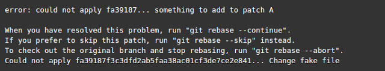

## Git高级命令  
#### 使用rebase而非merge来拉取上游修改
&emsp;&emsp;分支合并会被记录为一次合并提交，这种做法是很有意义的。比如说，可以通过这种方式来标识一个新特性被合并到了发布分支中。不过，当多个团队成员工作在一个项目中并使用常规的git pull来同步分支时，提交时间线就会被不必要的合并提交所污染。更好的做法则是使用git rebase将一个feature分支变基到master分支：  
```
$ git checkout feature  
$ git rebase master  
```
&emsp;&emsp;这么做会将整个feature分支移动到master分支的起点，它会合并master分支上所有新的提交。不过，相比于使用合并提交来说，变基会通过在原来的分支中为每次提交创建全新提交来重写项目历史。变基的主要好处在于你会得到一个更加整洁的项目历史。此外，这里还有关于变基的陷阱的一些讨论。  

#### 在执行git rebase后解决合并冲突  
&emsp;&emsp;正如能力越大责任就越大一样。在执行git rebase时，你可能会遇到合并冲突的情况。合并冲突表示两个提交修改了同一个文件的同一行，Git不知道该应用哪一个修改。这会导致如下所示的错误消息：  
  
&emsp;&emsp;Git会为你提供3个选择来修复导致冲突的提交（fa39187）：  
1. 可以运行git rebase –abort来完全取消变基。这么做会取消变基修改，并将分支置回到执行git rebase之前的状态。  
2. 可以运行git rebase –skip来完全忽略该提交。这样，有问题的提交所引入的变化就不会被添加到历史中。  
3. 可以使用与合并冲突相同的标准步骤来解决冲突。  

#### 临时性保存修改
&emsp;&emsp;在工作进行中时，有些东西常常会处于凌乱的状态。如果这时需要切换到不同的分支该怎么办呢？Git是不允许你这么做的，因为还有尚未保存的修改。坦率地说，你并不想将半成品提交上去，后面再来修改。这个问题的解决之道就是使用git stash命令。Stash会接收工作目录的当前状态（比如说，修改了的追踪文件与暂存区的修改等），并将其保存到未完成的修改栈中，这样后面随时可以再来修改。可以通过如下命令来暂存你的工作：  
```
$ git stash  
Saved working directory and index state WIP on feature: 3fc175f fix race condition
HEAD is now at 3fc175f fix race condition  
```
&emsp;&emsp;现在，工作目录就是干净的了：
```
$ git status  
# On branch feature  
nothing to commit, working directory clean  
```  
&emsp;&emsp;这时就可以安全地切换分支做别的事情了。不过不必担心，暂存的提交依旧还在：  
```
$ git stash list  
stash@{0}: WIP on feature: 3fc175f fix race condition  
```
&emsp;&emsp;稍后，在回到feature分支后，你就可以取回所有暂存的变更了：  
```
$ git stash pop  
On branch feature  
Changes not staged for commit:  
  (use "git add ..." to update what will be committed)  

     modified:   index.html  
Dropped refs/stash@{0} (ac2321cc3a33ba712b8e50c99a99d3c20da9d6b8)  
```
&emsp;&emsp;关于暂存，还有其他一些选项可用，如下所示：  
```
$ git stash save "describe it"   # give the stash a name  
$ git stash clear                # delete a stashed commit  
$ git stash save --keep-index    # stash only unstaged files  
```

#### 克隆一个特定的远程分支  
&emsp;&emsp;如果想要从远程仓库中克隆一个特定的分支该怎么做呢？通常你会使用git clone，不过这么做会将所有其他分支都一并克隆下来。一个便捷的方式是使用git remote add：  
```
$ git init    
$ git remote add -t  -f origin   
$ git checkout   
```

#### 将cherry-pick远程提交合并到自己的分支中  
&emsp;&emsp;更有甚者，如果只想将远程仓库的一个特定提交合并到自己的分支中该怎么做呢？可以使用git cherry-pick 来选择给定SHA值的提交，然后将其合并到当前分支中：  
```
$ get cherry-pick  
```

#### 应用来自于不相关的本地仓库的补丁  
&emsp;&emsp;如果需要将另一个不相关的本地仓库的提交补丁应用到当前仓库该怎么做呢？答案就是下面这条命令：  
```
$ git --git-dir=/.git format-patch -k -1 --stdout  | git am -3 -k  
```

#### 忽略追踪文件中的变更  
&emsp;&emsp;如果你和你的同事操纵的是相同分支，那么很有可能需要频繁执行git merge或是git rebase。不过，这么做可能会重置一些与环境相关的配置文件，这样在每次合并后都需要修改。与之相反，你可以通过如下命令永久性地告诉Git不要管某个本地文件：  
```
$ git update-index --assume-unchanged   
```

#### 每隔X秒运行一次git pull  
&emsp;&emsp;通常，合并冲突出现的原因在于你正在工作的本地仓库不再反映远程仓库的当前状态。这正是我们为什么每天早晨要首先执行一次git pull的缘故。此外，你还可以在后台通过脚本（或是使用GNU Screen）每隔X秒调用一次git pull：  
```
$ screen  
$ for((i=1;i<=10000;i+=1)); do sleep X && git pull; done  
```

#### 将子目录分隔为新的仓库  
&emsp;&emsp;有时，你可能需要将Git仓库中某个特定的目录转换为一个全新的仓库。这可以通过git filter-branch来实现：  
```
$ git filter-branch --prune-empty --subdirectory-filter  master  
# Filter the master branch to your directory and remove empty commits  
Rewrite 48dc599c80e20527ed902928085e7861e6b3cbe6 (89/89)  
Ref 'refs/heads/master' was rewritten  
```
&emsp;&emsp;现在，仓库会包含指定子目录中的所有文件。虽然之前的所有文件都会被删除，但他们依旧存在于Git历史中。现在可以将新的本地仓库推送到远程了。

#### 清理  
&emsp;&emsp;有时，Git会提示“untracked working tree files”会“overwritten by checkout”。造成这种情况的原因有很多。不过通常来说，我们可以使用如下命令来保持工作树的整洁，从而防止这种情况的发生：  
```
$ git clean -f     # remove untracked files  
$ git clean -fd    # remove untracked files/directories  
$ git clean -nfd   # list all files/directories that would be removed  
```

#### 将项目文件打成tar包，并且排除.git目录  
&emsp;&emsp;有时，你需要将项目副本提供给无法访问GitHub仓库的外部成员。最简单的方式就是使用tar或zip来打包所有的项目文件。不过，如果不小心，隐藏的.git目录就会包含到tar文件中，这会导致文件体积变大；同时，如果里面的文件与接收者自己的Git仓库弄混了，那就更加令人头疼了。轻松的做法则是自动从tar文件中排除掉.git目录：  
```
$ tar cJf .tar.xz / --exclude-vcs  
```

#### 查找修改者  
&emsp;&emsp;最后，如果出现混乱的情况，你一定想要找出是谁造成的。如果生产服务器宕机，那么找到罪魁祸首是比较容易的事情：只需执行git blame。该命令会显示出文件中每一行的作者，提交hash则会找出该行的上一次修改，还能看到提交的时间戳：  
```
$ git blame
```
&emsp;&emsp;当然，Git命令是非常多的，除了上面介绍的12个重要命令外，相信各位InfoQ读者在日常工作过程中也有自己偏爱且好用的一些命令，不妨以评论的形式与其他读者一同分享。  