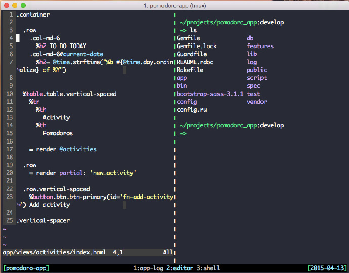

## Linux 奇巧淫技
***

### Tmux终端分屏

从图中可以看到：  
* 左侧：Vim  
* 右侧：系统 Shell  
* 左下方：Tmux 会话的名字（“pomodoro-app”）  
* 下方的中部：当前会话中的 Tmux 窗口（“app log”、“editor”和 “shell”）  
* 右下方：当前的日期  
#### 安装Tmux  
```
$ sudo yum install tmux  
```

#### Tmux 的快捷键前缀（Prefix）  
为了使自身的快捷键和其他软件的快捷键互不干扰，Tmux 提供了一个快捷键前缀。当想要使用快捷键时，需要先按下快捷键前缀，然后再按下快捷键。Tmux 所使用的快捷键前缀默认是组合键 Ctrl-b（同时按下 Ctrl 键和 b 键）。例如，假如你想通过快捷键列出当前 Tmux 中的会话（对应的快捷键是 s），那么你只需要做以下几步：  
* 按下组合键 Ctrl-b (Tmux 快捷键前缀)  
* 放开组合键 Ctrl-b  
* 按下 s 键  

一些小建议：  
建议对调 Ctrl 键和 Caps-Lock 键的功能。通过按下 Caps-Lock 键来代替 Ctrl 键将会非常实用。因为在编码过程中，你需要频繁地按下 Ctrl 键，而由于 Caps-Lock 与手指在键盘的起始位置处于同一直线，所以按下 Caps-Lock 键会更加容易、便捷。  
其次，我建议将 Tmux 的快捷键前缀变为 Ctrl - a。用 Caps-Lock 键替代了 Ctrl 键之后，由于 Caps-Lock 键与 a 键离得更近，所以按下 Ctrl - a 就将会比按下 Ctrl - b 更容易、更便捷。  
若要将快捷键前缀变更为 Ctrl-a ，请将以下配置加入到 Tmux 的配置文件 ~/.tmux.conf 中：  
```
unbind C-b  
set -g prefix C-a
```
##### 基本使用
```
1. tmux         #运行 tmux -2 以256终端运行
2. C-b d        #返回主 shell ， tmux 依旧在后台运行，里面的命令也保持运行状态
3. tmux ls      #显示已有tmux会话（C-b s）
4. tmux attach-session -t 数字 # 选择tmux  
5. tmux new-session -s session-name  
6. tmux kill-session -t session-name  
```

##### 快捷键
tmux 的使用主要就是依靠快捷键，通过 C-b 来调用。  
```
1. 
```


#### Tmux的配置文件  
每当开启一个新的会话时，Tmux 都会先读取 ~/.tmux.conf 这个文件。该文件中存放的就是对 Tmux 的配置。  
小提示：如果你希望新的配置项能够立即生效，那么你可以将下面这一行配置加入到文件 ~/.tmux.conf 中。  
```
#bind a reload key
bind R source-file ~/.tmux.conf; display-message "Config reloaded..."
```
这样配置了之后，每当向 ~/.tmux.conf 文件中添加了新的配置，只需要按下 Ctrl-b r 就可以重新加载配置并使新的配置生效，从而免去了开启一个新的会话。  

#### Tmux中最棒的功能  

### centos7如何设置成开机默认命令行模式  
CentOS7不再使用init托管服务了，改成了systemd，自然不需要/etc/inittab这个文件了。  
```
$ ln -sf /lib/systemd/system/multi-user.target /etc/systemd/system/default.target
```
因此，更改方法为：  
1. 命令模式  
```
systemctl set-default multi-user.target
```
2. 图形模式 
```
systemctl set-default graphical.target  
```